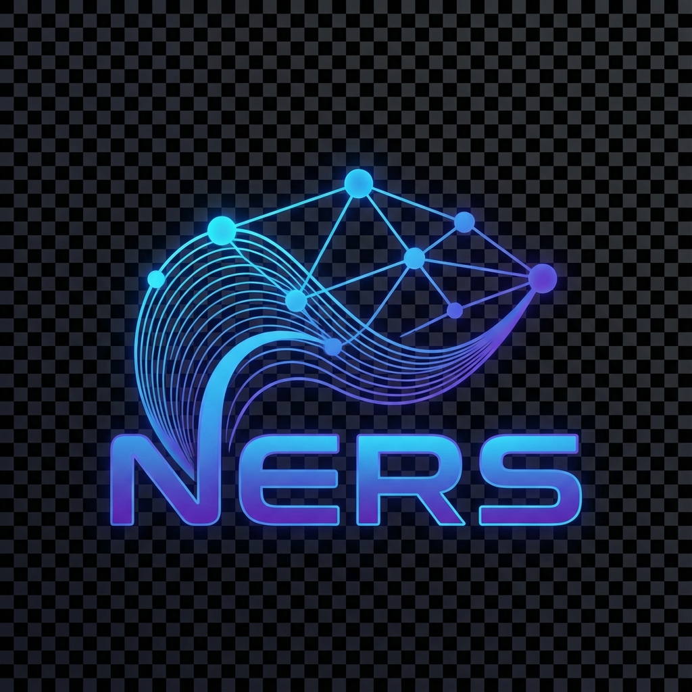

<p align="center">
  
</p>

<h1 align="center">NERS</h1>
<p align="center"><strong>Neuro-Elastic Rust Server</strong></p>
<p align="center">A high-performance, lock-free, multi-core web server kernel with HTTP/2, self-adaptive tuning, and ML-driven policies.</p>

<p align="center">
  
  
  
</p>

---

## Features

| Feature | Description |
|---------|-------------|
| **Multi-Core** | Stage-per-core architecture with CPU affinity |
| **HTTP/2** | Full support with HPACK, stream multiplexing, flow control |
| **Lock-Free** | Per-core slab sharding, NUMA-aware memory allocation |
| **Self-Adaptive** | Behavioral autotuning with rollback safety |
| **ML-Driven** | Feature extraction and learned tuning policies |
| **Observable** | Per-stage metrics, trend detection, bottleneck identification |

## Performance

| Metric | Value |
|--------|-------|
| Throughput | 200K+ req/sec (8-core) |
| p99 Latency | <2ms |
| HTTP/2 Streams | 100+ per connection |
| Lock Contention | <1% |

---

## Quick Start

### Prerequisites

- Rust 1.70 or later
- Linux (recommended) or macOS

### Build from Source

```bash
# Clone the repository
git clone https://github.com/YASSERRMD/ners.git
cd ners

# Build release
cargo build --release

# Run server
RUST_LOG=info ./target/release/ners
```

### Docker

```bash
# Build image
docker build -t ners:latest .

# Run container
docker run -d -p 8080:8080 --name ners ners:latest

# View logs
docker logs -f ners
```

### Docker Compose

```yaml
version: '3.8'
services:
  ners:
    image: ners:latest
    build: .
    ports:
      - "8080:8080"
    environment:
      - RUST_LOG=info
    restart: unless-stopped
```

---

## Deployment

### Linux (systemd)

1. **Build the binary:**
   ```bash
   cargo build --release
   sudo cp target/release/ners /usr/local/bin/
   ```

2. **Create service file:**
   ```bash
   sudo tee /etc/systemd/system/ners.service > /dev/null <<EOF
   [Unit]
   Description=NERS Web Server
   After=network.target

   [Service]
   Type=simple
   User=www-data
   ExecStart=/usr/local/bin/ners
   Restart=on-failure
   Environment=RUST_LOG=info

   [Install]
   WantedBy=multi-user.target
   EOF
   ```

3. **Enable and start:**
   ```bash
   sudo systemctl daemon-reload
   sudo systemctl enable ners
   sudo systemctl start ners
   ```

### macOS (launchd)

1. **Build and install:**
   ```bash
   cargo build --release
   sudo cp target/release/ners /usr/local/bin/
   ```

2. **Create plist:**
   ```bash
   sudo tee /Library/LaunchDaemons/com.ners.server.plist > /dev/null <<EOF
   <?xml version="1.0" encoding="UTF-8"?>
   <!DOCTYPE plist PUBLIC "-//Apple//DTD PLIST 1.0//EN" "http://www.apple.com/DTDs/PropertyList-1.0.dtd">
   <plist version="1.0">
   <dict>
       <key>Label</key>
       <string>com.ners.server</string>
       <key>ProgramArguments</key>
       <array>
           <string>/usr/local/bin/ners</string>
       </array>
       <key>RunAtLoad</key>
       <true/>
       <key>KeepAlive</key>
       <true/>
       <key>EnvironmentVariables</key>
       <dict>
           <key>RUST_LOG</key>
           <string>info</string>
       </dict>
   </dict>
   </plist>
   EOF
   ```

3. **Load service:**
   ```bash
   sudo launchctl load /Library/LaunchDaemons/com.ners.server.plist
   ```

### Kubernetes

```yaml
apiVersion: apps/v1
kind: Deployment
metadata:
  name: ners
spec:
  replicas: 3
  selector:
    matchLabels:
      app: ners
  template:
    metadata:
      labels:
        app: ners
    spec:
      containers:
      - name: ners
        image: ners:latest
        ports:
        - containerPort: 8080
        resources:
          requests:
            cpu: "2"
            memory: "512Mi"
          limits:
            cpu: "4"
            memory: "1Gi"
        env:
        - name: RUST_LOG
          value: "info"
---
apiVersion: v1
kind: Service
metadata:
  name: ners
spec:
  type: LoadBalancer
  ports:
  - port: 80
    targetPort: 8080
  selector:
    app: ners
```

### AWS ECS

```json
{
  "family": "ners",
  "containerDefinitions": [
    {
      "name": "ners",
      "image": "your-ecr-repo/ners:latest",
      "portMappings": [
        {
          "containerPort": 8080,
          "hostPort": 8080,
          "protocol": "tcp"
        }
      ],
      "environment": [
        {
          "name": "RUST_LOG",
          "value": "info"
        }
      ],
      "cpu": 2048,
      "memory": 1024
    }
  ],
  "requiresCompatibilities": ["FARGATE"],
  "networkMode": "awsvpc",
  "cpu": "2048",
  "memory": "1024"
}
```

---

## Configuration

### Environment Variables

| Variable | Description | Default |
|----------|-------------|---------|
| `RUST_LOG` | Log level (error, warn, info, debug, trace) | `info` |
| `NERS_PORT` | Server port | `8080` |
| `NERS_WORKERS` | Number of worker threads | CPU cores |
| `NERS_MAX_CONNS` | Maximum connections per worker | `1000` |

---

## API Endpoints

| Endpoint | Method | Description |
|----------|--------|-------------|
| `/` | GET | Default landing page |
| `/api/test` | GET | Test endpoint |
| `/health` | GET | Health check |
| `/metrics` | GET | Prometheus-compatible metrics |

---

## Architecture

```
                    ┌─────────────────────────────────────────────┐
                    │              Network Layer                  │
                    └─────────────────┬───────────────────────────┘
                                      │
    ┌─────────┬───────────┬───────────┼───────────┬───────────┬─────────┐
    │ Core 0  │  Core 1   │  Core 2   │  Core 3   │  Core 4   │ Core 5  │
    │ NetIn   │  Parse    │  Route    │    App    │  Encode   │ NetOut  │
    └────┬────┴─────┬─────┴─────┬─────┴─────┬─────┴─────┬─────┴────┬────┘
         │         │           │           │           │          │
         └─────────┴───────────┴─────┬─────┴───────────┴──────────┘
                                     │
                    ┌────────────────┴────────────────┐
                    │   Metrics Analyzer + Tuner     │
                    │   ML Policy Bridge             │
                    └─────────────────────────────────┘
```

---

## Crates

| Crate | Description |
|-------|-------------|
| `ners-core` | Stage pipeline, orchestrator, slab sharding |
| `ners-proto-http` | HTTP/1.1 and HTTP/2 parsing, HPACK |
| `ners-metrics` | Per-stage metrics collection |
| `ners-ml` | ML policy bridge, feature extraction |

---

## Development

### Running Tests

```bash
cargo test
```

### Benchmarking

```bash
cargo bench
```

### Code Coverage

```bash
cargo tarpaulin --out Html
```

---

## License

MIT License - see [LICENSE](LICENSE) file.

---

## Contributing

Contributions are welcome! Please read our contributing guidelines before submitting a PR.

1. Fork the repository
2. Create a feature branch (`git checkout -b feature/amazing-feature`)
3. Commit your changes (`git commit -m 'Add amazing feature'`)
4. Push to the branch (`git push origin feature/amazing-feature`)
5. Open a Pull Request

---

<p align="center">Built with ❤️ in Rust</p>
